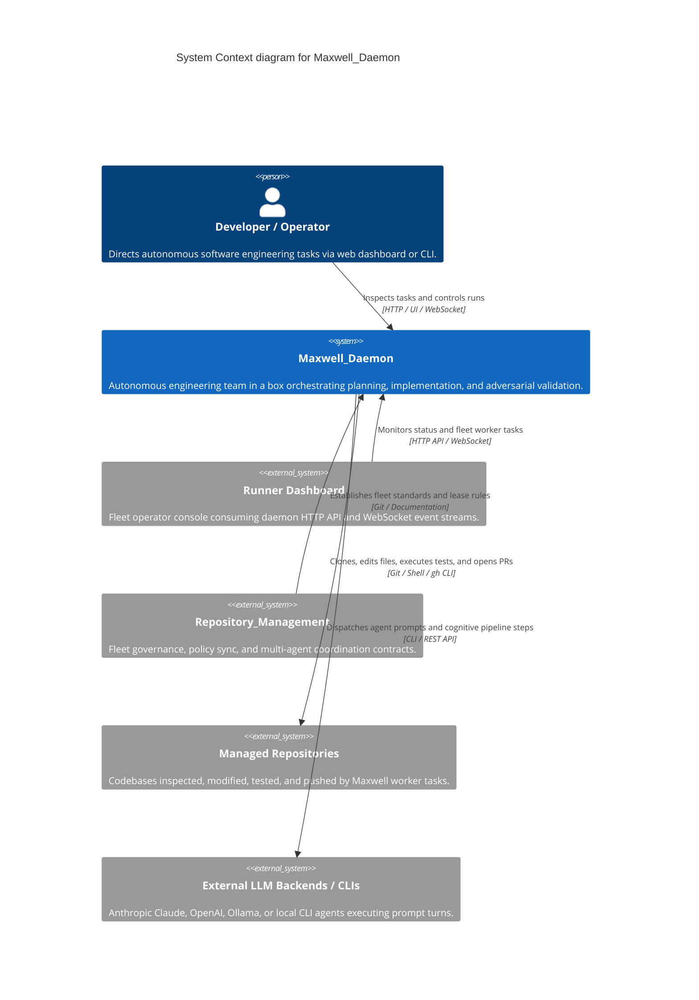
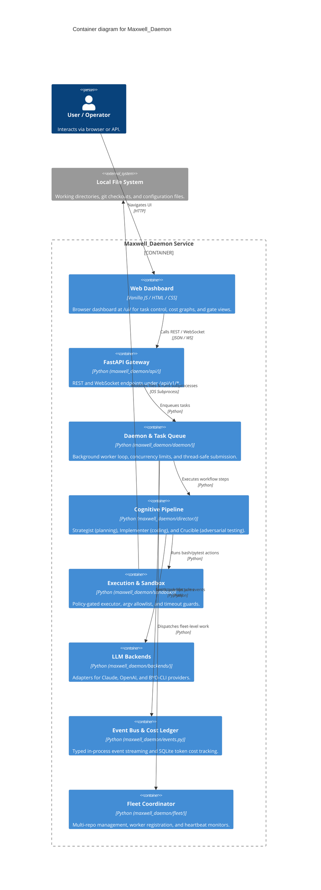

# Architecture Map — Maxwell_Daemon

This document defines the canonical Mermaid C4 architecture map for `Maxwell_Daemon`, providing verified context, container boundaries, capability-to-component traceability, and architecture change history.

## Context View (C4Context)

## Container View (C4Container)

## Feature Map

| Capability | Component | Interface | Evidence |
| --- | --- | --- | --- |
| Web Dashboard Console | `maxwell_daemon.api.ui` | Browser `/ui/`, gate-aware status | `tests/unit/test_api_status.py` |
| REST API & OpenAPI Contract | `maxwell_daemon.api` | `/api/v1/*`, FastAPI router | `tests/unit/test_openapi_docs_sync.py` |
| Thread-Safe Task Queue | `maxwell_daemon.daemon` | `submit_threadsafe()`, stall cancellation | `tests/unit/test_daemon.py` |
| Cognitive Pipeline Roles | `maxwell_daemon.director` | Strategist, Implementer, Crucible state machine | `tests/unit/test_director.py` |
| Policy-Gated Execution | `maxwell_daemon.sandbox` | `argv` allowlist, workspace boundaries | `tests/unit/test_sandbox.py` |
| Backend CLI Adapters | `maxwell_daemon.backends` | Claude, OpenAI, BYO-CLI adapters | `tests/unit/test_backends.py` |
| Typed Event Streaming | `maxwell_daemon.events` | `EventBus`, `/api/v1/events` WebSocket | `tests/unit/test_events.py` |
| Fleet Topology & Dispatch | `maxwell_daemon.fleet` | `fleet.yaml` manifest, worker registration | `tests/unit/test_fleet.py` |
| Architecture Map Contract | `scripts.architecture_map_contract` | `validate_architecture_map()` | `tests/scripts/test_architecture_map_contract.py` |

## Architecture Change Log

| Date | PR / Issue | Description |
| --- | --- | --- |
| 2026-09-10 | #1601 | Adopt maintainable Mermaid C4 architecture-map contract and automated CI verification |
