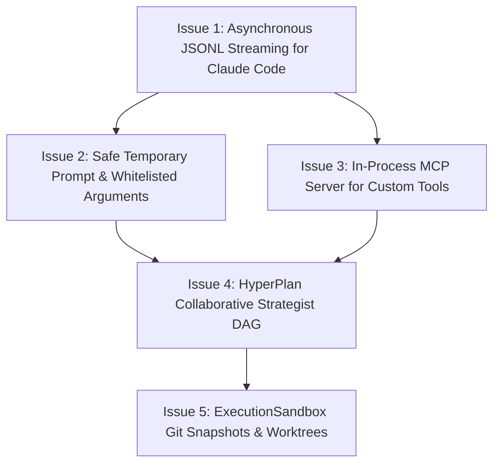

# Epic: Porting Advanced OpenADE Features to Maxwell Daemon Control Plane

**Goal:** Enhance the Maxwell Daemon autonomous software engineering control plane with key capabilities inspired by Bearly AI's **OpenADE** (Agentic Development Environment). These features will bring true JSONL event streaming, command length safety, dynamic MCP server tooling, collaborative multi-agent planning DAGs (HyperPlan), and automated git snapshot/worktree rollbacks to Maxwell.

---

## 📅 Milestones & GitHub Issues

---

## Issue 1: Asynchronous JSONL Streaming CLI Adapter for Claude Code
**Description:** Refactor the Claude Code CLI adapter to use true asynchronous streaming. Instead of running `claude -p` in one-shot mode (`--output-format json`) and blocking until completion, parse the stdout JSON lines output in real-time and yield events as they are produced.

### 📋 Subtasks
* [ ] **Implement Async Subprocess Line Reader in Python**
  - Read lines from the subprocess `stdout` stream using `asyncio.StreamReader` and `readline()`.
  - Handle potential encoding/decoding errors gracefully by replacing invalid characters (`errors="replace"`).
  - *Reference OpenADE Source:* [spawn.ts:L168-185](file:///c:/Users/diete/Repositories/openade/projects/harness/src/util/spawn.ts#L168-185) showing readline event configuration and parsing.
* [ ] **Configure Claude CLI for Streaming Output**
  - Update `claude` subprocess arguments to use `--output-format stream-json` and `--verbose`.
  - Pass the `--dangerously-skip-permissions` or `--permission-mode dontAsk` flags depending on read/write modes.
  - *Reference OpenADE Source:* [args.ts:L218-220](file:///c:/Users/diete/Repositories/openade/projects/harness/src/harnesses/claude-code/args.ts#L218-220) showing command construction for stream-json.
* [ ] **Develop Claude Event Parser in Python**
  - Build a parser in `maxwell_daemon/backends/claude_code.py` to match the 14-variant event union (`system:init`, `assistant`, `tool_progress`, `user`, `result`).
  - Extract and yield raw text blocks, thinking cycles, and tool use events.
  - Parse the final `result` event to extract accurate costs and token counts (`usage.input_tokens`, `usage.output_tokens`, `total_cost_usd`, `duration_ms`).
  - *Reference OpenADE Source:* [index.ts:L272-334](file:///c:/Users/diete/Repositories/openade/projects/harness/src/harnesses/claude-code/index.ts#L272-334) detailing the event pipeline extraction.
* [ ] **Connect Parser Stream to Maxwell Event Bus**
  - Update `maxwell_daemon.backends.claude.ClaudeCodeCLIBackend.stream` to yield parsed text tokens and tool progress directly into the event stream, broadcasting them via the WebSocket router `/api/v1/events`.

---

## Issue 2: Safe Temporary Prompt & Whitelisted Arguments
**Description:** Prevent shell-level argument length limits (`E2BIG` error) and process-monitor disclosure of sensitive prompt strings by writing prompts to temporary files. Additionally, enforce strict whitelisting of CLI tools and Bash commands in read-only mode.

### 📋 Subtasks
* [ ] **Implement Temporary System and User Prompt Files**
  - Create secure temporary files (`tempfile.NamedTemporaryFile`) to store the system prompt and append prompt.
  - Ensure files are read-only to the daemon process (owner-only permissions e.g., `0o600`).
  - Construct Claude arguments using `--system-prompt-file` and `--append-system-prompt-file` instead of CLI string properties.
  - *Reference OpenADE Source:* [index.ts:L247-258](file:///c:/Users/diete/Repositories/openade/projects/harness/src/harnesses/claude-code/index.ts#L247-258) showing tempfile creation and cleanup mapping.
* [ ] **Introduce Tool and Command Whitelisting in Read-Only Mode**
  - When a task runs in read-only mode, pass `--permission-mode dontAsk` to Claude Code CLI to prevent interactive prompts.
  - Whitelist safe read-only commands (e.g. `git diff`, `git status`, `ls`, `grep`, `cat`, `tree`) using `--allowedTools`.
  - Disallow editing/writing tools (`Edit`, `Write`, `NotebookEdit`) using `--disallowed-tools`.
  - *Reference OpenADE Source:* [args.ts:L23-148](file:///c:/Users/diete/Repositories/openade/projects/harness/src/harnesses/claude-code/args.ts#L23-148) detailing lists of safe Bash commands and tool overrides.
* [ ] **Implement Safe Process Exit Cleanup Context Manager**
  - Write a Python context manager to guarantee the deletion of all temp files and sockets after the subprocess exits (success or failure).

---

## Issue 3: In-Process MCP Server for Custom Tools
**Description:** Expose Maxwell Daemon's custom backend tools and database search skills (such as ChEMBL, PubMed, ClinicalTrials, genomic database queries) to local coding CLIs using a dynamic in-process Model Context Protocol (MCP) server.

### 📋 Subtasks
* [ ] **Integrate Python MCP SDK**
  - Add the `mcp` library to dependencies in `pyproject.toml`.
  - Implement a fast in-process HTTP or stdio MCP server inside `maxwell_daemon/mcp/server.py`.
  - Register Maxwell's existing Pydantic-based database search tools, sequence fetchers, and validators on this server.
  - *Reference OpenADE Source:* [tool-server.ts](file:///c:/Users/diete/Repositories/openade/projects/harness/src/util/tool-server.ts) detailing how client tools are parsed and served via an in-memory MCP server.
* [ ] **Generate Dynamic MCP Config Files**
  - Generate a temporary `mcp-config.json` containing the server configuration (commands, HTTP URL, or stdio pipe definitions) and a short-lived authorization token.
  - *Reference OpenADE Source:* [mcp-config.ts](file:///c:/Users/diete/Repositories/openade/projects/harness/src/harnesses/claude-code/mcp-config.ts) showing configurations for stdio/HTTP servers.
* [ ] **Pipe MCP Config to Child Process**
  - Configure the subprocess spawning command to pass `--mcp-config <path>` and `--strict-mcp-config` to the Claude Code CLI.
  - Ensure the parent env variables (such as local tool authentication tokens) are merged with the child process env.
  - *Reference OpenADE Source:* [index.ts:L237-243](file:///c:/Users/diete/Repositories/openade/projects/harness/src/harnesses/claude-code/index.ts#L237-243) showing arg injection and file cleanup setup.

---

## Issue 4: HyperPlan Collaborative Strategist DAG in Python
**Description:** Implement a collaborative multi-agent planning engine in the Maxwell Strategist phase. This allows running parallel planners (e.g. Gemini, Claude, OpenAI) to design plan options, a critic agent to review the plans, and a reconciler agent to synthesize a single approved implementation plan.

### 📋 Subtasks
* [ ] **Implement DAG Structure Primitives in Python**
  - Create a graph representation for planning steps: `plan` (start node), `review` (1 parent), `reconcile` ($\ge 1$ parents), and `revise` (1 review parent + resume target node).
  - Write a validator that verifies graph properties (e.g. no cycles, single terminal node).
  - *Reference OpenADE Source:* [strategies.ts:L118-207](file:///c:/Users/diete/Repositories/openade/projects/web/src/hyperplan/strategies.ts#L118-207) detailing validation invariants.
* [ ] **Build Topological Sort and Parallel Execution Layer**
  - Group graph steps into parallelizable layers by depth.
  - Run independent planning steps concurrently using `asyncio.gather`.
  - Pass the results of previous planning steps as inputs to downstream review/reconciliation steps.
  - *Reference OpenADE Source:* [strategies.ts:L217-276](file:///c:/Users/diete/Repositories/openade/projects/web/src/hyperplan/strategies.ts#L217-276) for topological sort and layer grouping.
  - *Reference OpenADE Source:* [HyperPlanExecutor.ts:L120-145](file:///c:/Users/diete/Repositories/openade/projects/web/src/hyperplan/HyperPlanExecutor.ts#L120-145) for parallel execution loops.
* [ ] **Create Planning Prompt Generators**
  - Implement prompt builders for each step primitive (incorporating context, feedback review, and reconciliation merges).
  - *Reference OpenADE Source:* [prompts.ts](file:///c:/Users/diete/Repositories/openade/projects/web/src/hyperplan/prompts.ts) showing system hints and text structures for reviews and revisions.
* [ ] **Integrate DAG Planner in Maxwell's Task Queue**
  - Modify `maxwell_daemon.daemon` to support multi-stage task graphs, allowing developers to review and comment on the finalized plan before executing edits.

---

## Issue 5: ExecutionSandbox Git Snapshots & Worktrees for Sandbox Safety
**Description:** Implement robust environment isolation and recovery features in Maxwell's `ExecutionSandbox`. Ensure the repository state can be snapshotted and rolled back, and isolate running tasks using Git worktrees.

### 📋 Subtasks
* [ ] **Implement Git Snapshot and Rollback Utility**
  - Write a Python class `maxwell_daemon/sandbox/git.py` that interfaces with the local git repository (e.g., using `subprocess` calls or `GitPython`).
  - Implement a `take_snapshot()` method that tracks uncommitted changes (`git stash` or committing dirty states to a temp branch).
  - Implement a `restore_snapshot()` method that performs a hard reset and restores the clean state.
* [ ] **Implement Temporary Git Worktree Manager**
  - Implement a `create_worktree()` context manager that creates a temporary git worktree in a separate system directory.
  - Route the `ExecutionSandbox` file modifications and tests to run in the worktree directory rather than the developer's active workspace.
  - Automatically remove the worktree (`git worktree remove --force <path>`) on completion or failure of the task.
  - *Reference OpenADE Source:* [README.md:L123-128](file:///c:/Users/diete/Repositories/openade/README.md#L123-128) outlining snapshot rollback and worktree strategy.
